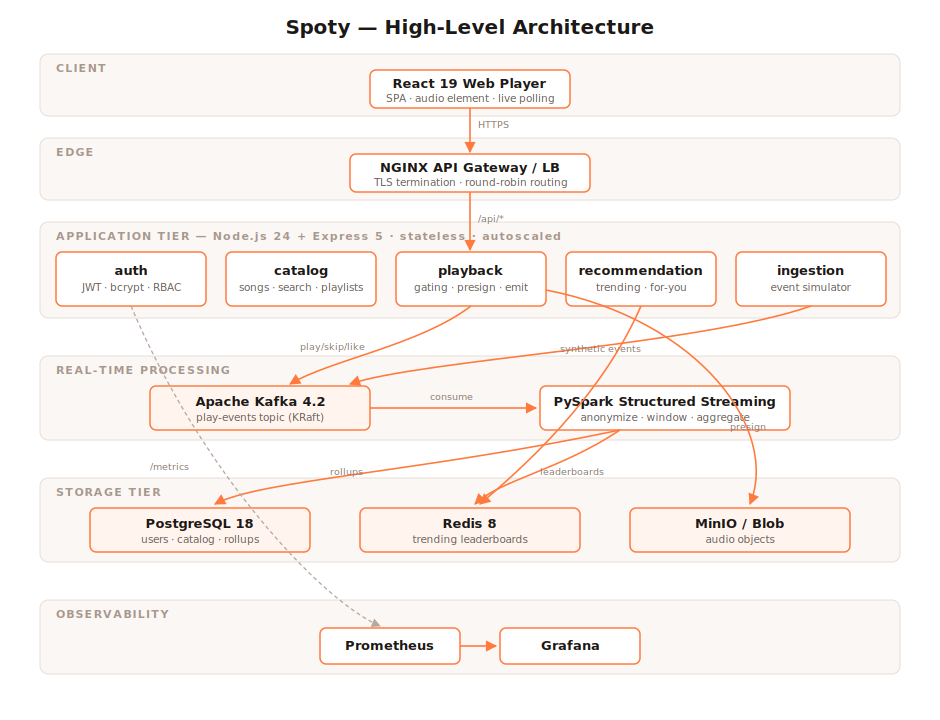
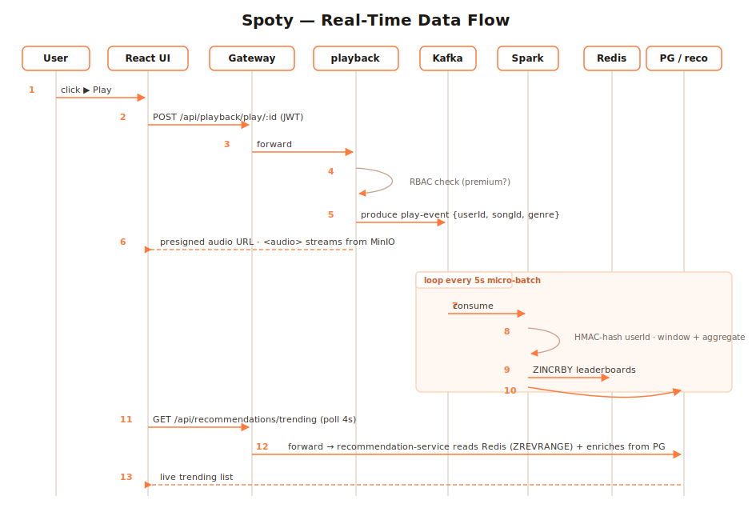
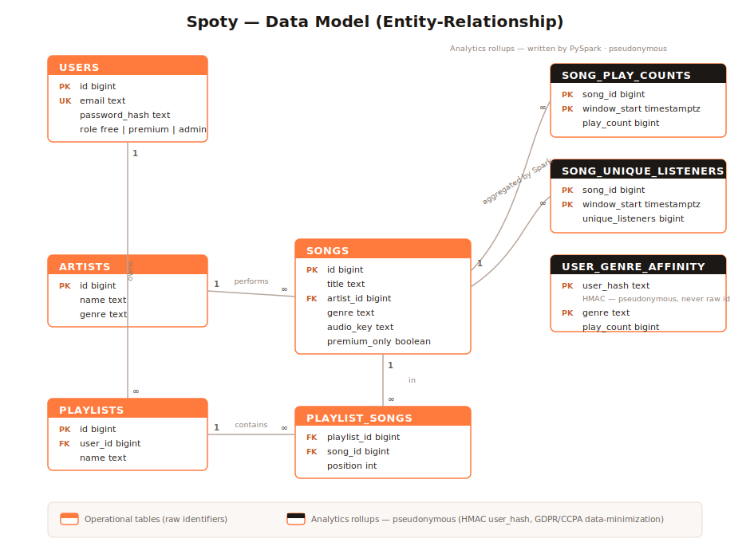

# System Proposal - Spoty: Scalable & Secure Distributed System for Real-Time Data Processing

**Project:** Distributed cloud system for real-time music streaming (Spotify-style)
**Prototype:** Local Docker Compose stack mapped to Microsoft Azure
**Date:** 2026

---

## 1. Problem Statement

Modern music-streaming platforms such as Spotify serve **hundreds of millions of
concurrent users**, each generating a continuous stream of interaction events
(plays, skips, likes, pauses). The platform must simultaneously:

- stream audio with **low latency** and high availability,
- ingest and process **millions of events per second** in real time to power
  trending charts and personalized recommendations,
- protect **user privacy** and comply with regulations (GDPR/CCPA),
- remain **cost-efficient** while scaling elastically with demand.

A single monolithic server cannot meet these requirements. The problem is therefore
to **design and implement a distributed, fault-tolerant, secure system** that
processes streaming data in real time and scales horizontally.

## 2. Objectives

1. Design a **distributed architecture** for real-time data processing and storage.
2. Implement **secure communication** (TLS), **authentication/authorization** (JWT + RBAC), and **encryption**.
3. Process interaction events in real time with a **distributed framework (Apache Spark)** fed by **Apache Kafka**.
4. Achieve **horizontal scalability** and **load balancing** via containers and Kubernetes.
5. Address **privacy** through anonymization/pseudonymization and regulatory compliance.
6. Make the system **observable** (metrics, dashboards) and **cost-aware** on the cloud.

## 3. Scope

**In scope:** user authentication & RBAC; music catalog & playback; event ingestion;
real-time stream processing (trending + recommendation signals); object/relational/cache
storage; API gateway & load balancing; containerization & orchestration; monitoring;
security & privacy controls; performance, deployment and cost analysis.

**Out of scope:** payment/billing, native mobile apps, a production-grade ML
recommender (a transparent heuristic recommender is used to demonstrate the pipeline),
and a globally distributed multi-region deployment (discussed as a future improvement).

## 4. Requirements

### 4.1 Functional
- Register/login; issue and validate JWTs; role-based access (free / premium / admin).
- Browse/search catalog; manage playlists.
- Stream audio via time-limited **presigned URLs**; gate premium-only tracks.
- Emit and ingest **play / skip / like** events.
- Compute **real-time trending** and **personalized recommendations**.
- Expose **/metrics** for monitoring and dashboards.

### 4.2 Non-Functional
| Attribute | Target / Approach |
|-----------|-------------------|
| **Scalability** | Stateless services scaled horizontally; Kafka partitions; HPA autoscaling |
| **Low latency** | Redis cache for hot reads; async event pipeline keeps the request path short |
| **High availability** | Multiple replicas + load balancing; managed, replicated cloud services |
| **Fault tolerance** | Kafka durable log; Spark checkpointing (exactly-resume); restart policies |
| **Security** | TLS in transit; encryption at rest; JWT auth; RBAC; secrets management |
| **Privacy** | HMAC pseudonymization before analytics; data minimization; GDPR/CCPA |
| **Observability** | Prometheus metrics + Grafana dashboards (latency, throughput, uptime) |

## 5. Why a Distributed Cloud Architecture?

- **Decoupling & elasticity:** an event log (Kafka) decouples producers from
  consumers so each can scale independently and absorb traffic spikes.
- **Parallel real-time processing:** Spark distributes stream processing across
  workers, enabling horizontal throughput growth.
- **Independent scaling & resilience:** microservices scale and fail independently;
  orchestration restarts and reschedules unhealthy pods.
- **Managed cloud services** provide built-in replication, backup, and autoscaling,
  reducing operational burden and improving availability.

## 6. High-Level Architecture

**Data flow:** `Client → Gateway → Services → Kafka → Spark → Storage → Services → Client`.

Layers: **Client** (React) · **Edge** (NGINX gateway/LB + TLS) · **Services**
(stateless Express microservices) · **Streaming** (Kafka + Spark) · **Storage**
(PostgreSQL, Redis, MinIO/Blob) · **Observability** (Prometheus + Grafana).

The real-time event path is shown below:

### 6.1 Data Model

## 7. Technology Choices & Justification

| Component | Choice | Justification |
|-----------|--------|---------------|
| Services | **Node.js 24 + Express 5** | Lightweight, async, high-throughput I/O; quick to develop; clear modular structure |
| Messaging | **Apache Kafka 4.2 (KRaft)** | Durable, partitioned, industry-standard event log; **Kafka-API compatible with Azure Event Hubs** |
| Processing | **Apache Spark 4.1 (PySpark)** | Required distributed framework; unified streaming + batch; checkpoint-based fault tolerance |
| Object store | **MinIO** | S3-compatible, so the same client code runs unchanged against **Azure Blob** in production |
| Relational | **PostgreSQL 18** | ACID store for users, catalog, and rollups |
| Cache | **Redis 8** | Sub-millisecond reads; sorted sets are ideal for leaderboards |
| Edge | **NGINX** | Mature reverse proxy, load balancer, TLS terminator |
| Orchestration | **Docker + Kubernetes** | Containerization + declarative scaling, self-healing, HPA |
| Monitoring | **Prometheus + Grafana** | Widely used, well-documented metrics and dashboards |
| Load testing | **k6** | Scriptable, JS-based load/stress/scalability testing |

**Cloud mapping (Azure):** Kafka→Event Hubs, MinIO→Blob Storage, Postgres→Azure DB for
PostgreSQL, Redis→Azure Cache for Redis, Spark→HDInsight/Synapse/Databricks,
Docker/K8s→AKS, NGINX→Application Gateway, Prometheus/Grafana→Azure Monitor +
Managed Grafana. Detailed in [`04-deployment-documentation.md`](04-deployment-documentation.md).

## 8. Design Principles

- **Modularity:** each service owns one bounded concern and is independently
  deployable; shared concerns (auth, metrics) are small reusable libraries.
- **Statelessness:** services hold no session state (JWT), enabling horizontal scaling.
- **Loose coupling via events:** asynchronous Kafka pipeline isolates write path
  from analytics.
- **Fault tolerance by default:** durable log + checkpointing + restart policies.
- **Security and privacy built in:** least-privilege RBAC, encryption, pseudonymization.
- **Observability:** every service exposes Prometheus metrics.

## 9. Deliverables

Functional prototype (this repository) + five reports + diagrams, as listed in the
[README](../README.md).
