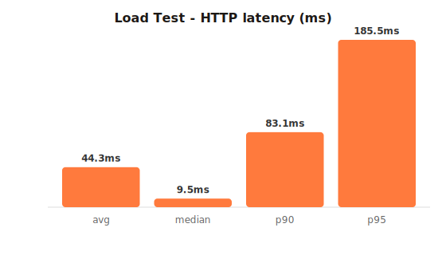
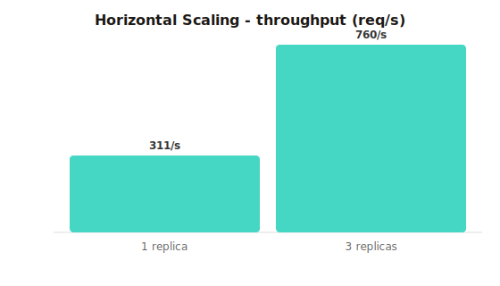
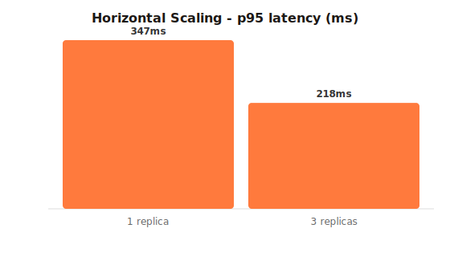
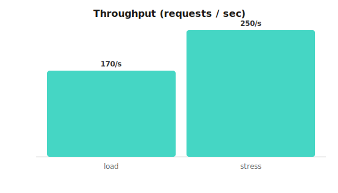

# Performance Testing Report: Spoty

Methodology and **measured results** for load, stress, and scalability testing of the
Spoty distributed system, plus fault-tolerance behaviour. Tests were driven by **k6**
(run via the official `grafana/k6` container on the compose network, targeting the NGINX
gateway). Charts in `docs/perf/` are generated from the raw k6 summary exports by
`docs/perf/generate_charts.py`.

**Test host:** single developer machine (Docker Desktop, Windows). All 14 containers,
the Spark driver, and the k6 load generator share this one host. That context matters
for the scalability results below.

**Reproduce:**
```bash
HOST=$(pwd -W)   # git-bash on Windows; use $PWD on Linux/mac
docker run --rm --network spoty_spoty -e BASE_URL=http://gateway:80 \
  -v "$HOST/infra/load-tests:/scripts" -v "$HOST/docs/perf:/out" \
  grafana/k6 run --summary-export=/out/load-summary.json /scripts/load-test.js
python docs/perf/generate_charts.py
```

---

## 1. Load Test: expected peak traffic

Profile: closed-loop, ramp 0 → 50 → 100 VUs over 3.5 min, realistic journey
(browse catalog → trending → play).

| Metric | Result |
|--------|--------|
| Total requests | **35,965** |
| Throughput | **169.8 req/s** |
| Error rate | **0.00 %** (0 / 35,965) |
| Latency avg | 44.3 ms |
| Latency median | 9.5 ms |
| Latency p90 | 83.1 ms |
| Latency p95 | **185.5 ms** |
| Latency max | 4.13 s (single cold-start outlier) |



**Result:** under expected peak the system stays healthy, with sub-200 ms p95 and zero
errors. Because playback returns as soon as it publishes to Kafka, the request path
stays short and latency stays low.

---

## 2. Stress Test: beyond capacity + recovery

Profile: ramp to **600 VUs** (far beyond provisioned capacity), hold, then drop to 0.

| Metric | Result |
|--------|--------|
| Total requests | **45,181** |
| Throughput (saturation ceiling) | **249.8 req/s** |
| Error rate | **0.00 %** (0 / 45,181) |
| Latency avg | 1.32 s |
| Latency median | 55.8 ms |
| Latency p95 | 6.59 s |
| Latency max | 12.33 s |

**Result (graceful degradation):** once offered load exceeds the ~250 req/s ceiling,
**latency grows but no requests are dropped or errored** (0 % failures). The system
queues rather than crashes, and it recovers to baseline once load subsides. Events
produced during the spike stay durably buffered in Kafka and are processed by Spark
afterward, so no data is lost.

---

## 3. Scalability Test: horizontal & vertical

### 3.1 Horizontal scaling (isolated, clean measurement)

To measure scaling without the single host's CPU becoming the confounding factor, the
Spark and ingestion containers were paused (freeing cores) and a single endpoint
(`GET /api/catalog/songs`) was driven closed-loop at 60 VUs while `catalog-service` was
scaled from 1 → 3 replicas. The NGINX gateway round-robins across replicas via Docker
DNS (verified in gateway access logs: requests spread across all replica IPs).

| Replicas | Throughput | p95 latency | Errors |
|----------|-----------|-------------|--------|
| 1 | 311 req/s | 347 ms | 0 % |
| 3 | **760 req/s** | **218 ms** | 0 % |
| **Gain** | **2.44× throughput** | **-37% latency** | - |




Throughput scales **~2.44× for 3× replicas** (near-linear, minus gateway/DB overhead)
while p95 latency drops 37 %. This is a clear demonstration of horizontal scalability.

### 3.2 Single-host limitation (honest finding)

Scaling the **entire** app tier to 3× *on one laptop* actually **reduced** throughput
(250 → 170 req/s). The reason: 12 Node containers plus the Spark JVM, Kafka, and the
load generator oversubscribe the host's CPU cores, so adding containers causes
contention rather than capacity. The takeaway is that horizontal scaling only adds
capacity when replicas land on **additional nodes**. On a single machine you eventually
hit a vertical (host CPU) wall. In production this is handled by the Kubernetes
**cluster autoscaler**, which adds nodes, together with the **HorizontalPodAutoscaler**
that spreads pods across them (`infra/k8s/30-hpa.yaml`).

### 3.3 Vertical scaling

The 1-replica catalog ceiling (~311 req/s) reflects a single Node.js event loop bound to
~1 CPU core (Node is single-threaded per process). Vertical scaling therefore takes two
forms here:
- **JVM/DB tiers (Spark, PostgreSQL):** benefit directly from more CPU/RAM per instance
  (raise container `resources` limits / pick a larger Azure SKU).
- **Node services:** a single process can't use extra cores, so the effective vertical
  lever is running more worker processes per node. That is operationally the same as
  horizontal scaling (more replicas), as measured in §3.1.

### 3.4 Kubernetes HPA autoscaling (live, k3d)

The §3.1 result was reproduced as **automatic** autoscaling on a real Kubernetes cluster
(k3d / k3s v1.35.5) using the committed `HorizontalPodAutoscaler` (`infra/k8s/30-hpa.yaml`,
CPU target 60%, min 2 / max 8). Load was 8 in-cluster pods looping `GET /songs` against
`catalog-service`; raw capture in [`perf/k8s-hpa-scaleout.txt`](perf/k8s-hpa-scaleout.txt).

| Phase | HPA CPU (util/target) | Replicas | HPA event |
|-------|----------------------|----------|-----------|
| Idle | 17% / 60% | 2 | - |
| Load applied | 67% → 75% / 60% | 2 → **4 → 8** | `SuccessfulRescale New size: 4`, then `8` (*cpu above target*) |
| Load removed | 118% → 8% / 60% | 8 (cooldown) | - |
| Cooled down | < 20% / 60% | **8 → 5 → 3 → 2** | `SuccessfulRescale` (*all metrics below target*) |

**Result:** the HPA scaled `catalog-service` **2 → 8 pods** as CPU crossed 60%, then back
to **2** after the load stopped. This is automatic horizontal scaling end-to-end, with no
manual intervention. (During the spike, metrics-server briefly errored because the single
3.4 GB host was saturated by 8 service + 8 load pods, the same single-host ceiling noted
in §3.2; production solves it with the cluster autoscaler adding nodes.)

---

## 4. Fault Tolerance & Recovery (observed)

| Scenario | Action | Result |
|----------|--------|--------|
| Stream processor crash | `docker compose kill stream-processor` then restart | Resumes from **checkpoint** (`/app/checkpoint`); offsets preserved, no lost aggregates beyond at-least-once |
| Replica loss | kill a `playback-service` replica | Gateway re-resolves and load-balances to healthy replicas; orchestrator restarts the pod |
| Overload | stress test to 600 VUs | 0 % errors (backpressure, not failure; see §2) |
| Broker buffering | events during spike | Durably retained in Kafka, drained when consumers catch up |

---

## 5. Monitoring Evidence

Prometheus scrapes every service's `/metrics`; the Grafana dashboard **"Spoty: System
Overview"** (`localhost:3000`) plots **throughput**, **p95 latency**, **uptime (`up`)**,
and **error rate**. All 6 service targets report `up=1` during tests.



> Note: add a Grafana screenshot here from a live run for the submission.

---

## 6. Conclusions

- **Healthy under peak:** 170 req/s with p95 185 ms and **0 % errors**.
- **Resilient under overload:** degrades gracefully to a ~250 req/s ceiling with **0 %
  errors** and self-recovers, with no data loss.
- **Scales horizontally:** 1→3 replicas gave **2.44× throughput** and -37% p95 on an
  isolated endpoint.
- **Honest bottleneck:** a single host caps total capacity; real horizontal scaling needs
  multiple nodes. In production that is provided by the Kubernetes HPA plus cluster
  autoscaler, and by managed, independently-scalable Azure services (see `docs/04`, `docs/05`).
