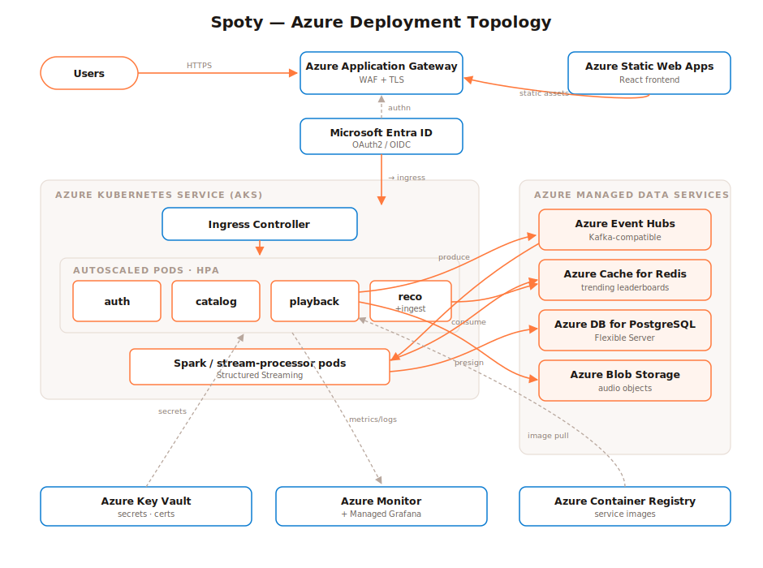

# Deployment Documentation: Spoty

Step-by-step guide to deploy Spoty **locally** (Docker Compose), on **Kubernetes**
(minikube/AKS), and the **Azure managed-service** target architecture, plus
troubleshooting and maintenance.

---

## 1. Prerequisites

| Tool | Version | Purpose |
|------|---------|---------|
| Docker + Compose | latest | Local stack |
| Node.js | 24 LTS | Local dev (optional) |
| k6 | 2.0 | Performance tests |
| kubectl + minikube | latest | Local Kubernetes (optional) |
| Azure CLI (`az`) | latest | Azure deployment |

---

## 2. Local Deployment (Docker Compose)

```bash
git clone <repo> && cd spoty
cp .env.example .env        # adjust secrets if desired
docker compose up --build   # first run pulls images + Spark Kafka jars
```

Startup order is handled by health checks: Postgres/Kafka/Redis/MinIO become healthy,
`audio-gen` generates demo WAVs, `minio-init` uploads them, then services start.

**Endpoints**

| URL | Service |
|-----|---------|
| http://localhost:8080 | Web player (via gateway) |
| http://localhost:3000 | Grafana (anonymous viewer; admin/admin) |
| http://localhost:9090 | Prometheus |
| http://localhost:9001 | MinIO console |
| localhost:5432 / 6379 / 29092 | Postgres / Redis / Kafka (host access) |

**Smoke test**
```bash
curl localhost:8080/api/catalog/songs                       # catalog (public)
# admin token. playback works for any role; ingestion control is admin-only
TOKEN=$(curl -s localhost:8080/api/auth/login -H 'content-type: application/json' \
  -d '{"email":"admin@spoty.dev","password":"Passw0rd!"}' | jq -r .token)
curl -X POST localhost:8080/api/playback/play/1 -H "Authorization: Bearer $TOKEN"
curl -X POST localhost:8080/api/ingestion/start -H "Authorization: Bearer $TOKEN" \
  -H 'content-type: application/json' -d '{"eventsPerSec":100}'
curl localhost:8080/api/recommendations/trending           # trending (public)
```

**Configuration** lives in `.env` (see `.env.example`): JWT secret, anonymization
salt, DB/Redis/Kafka/MinIO connection details, simulator rate.

### Enabling TLS at the gateway
1. Place `fullchain.pem` / `privkey.pem` in `infra/gateway/certs/`.
2. Add an SSL server block to `infra/gateway/nginx.conf`:
   ```nginx
   server { listen 443 ssl; ssl_certificate /etc/nginx/certs/fullchain.pem;
            ssl_certificate_key /etc/nginx/certs/privkey.pem; ... }
   ```
3. Mount the certs and publish `8443:443` in `docker-compose.yml`.

---

## 3. Kubernetes Deployment (k3d, verified live)

The manifests were deployed and **autoscaling verified on a real Kubernetes cluster**
using **k3d** (k3s-in-Docker). k3d is used instead of minikube because it is far lighter
(fits a Docker Desktop allocation of ~3.4 GB) and bundles **metrics-server** (needed for
HPA) and a built-in load balancer out of the box.

```bash
# 1) lightweight cluster (traefik disabled to save RAM; metrics-server is built in)
k3d cluster create spoty --servers 1 --agents 0 --k3s-arg "--disable=traefik@server:0"
# On Windows the kubeconfig may point at host.docker.internal; if kubectl times out,
# repoint it at the published API port on localhost:
#   kubectl config set-cluster k3d-spoty --server=https://127.0.0.1:<serverlb-port>

# 2) build app images and import them into the cluster (k3d has its own containerd)
docker compose build catalog-service              # + other services as needed
k3d image import -c spoty spoty-catalog-service:latest

# 3) namespace/config, then the Postgres schema+seed ConfigMap (REQUIRED, see note)
kubectl apply -f infra/k8s/00-namespace-config.yaml
kubectl -n spoty create configmap spoty-seed \
  --from-file=data/seed/01_schema.sql --from-file=data/seed/02_seed.sql

# 4) infra + services + autoscalers
kubectl apply -f infra/k8s/10-infra.yaml          # Postgres (mounts spoty-seed) + Redis/Kafka/MinIO
kubectl apply -f infra/k8s/20-services.yaml       # app Deployments + Services
kubectl apply -f infra/k8s/30-hpa.yaml            # HorizontalPodAutoscalers

kubectl -n spoty get pods,hpa -w                  # watch rollout + autoscaling
```

> **RAM-safe footprint:** on a single ~3.4 GB host the full stack (Kafka JVM + Spark)
> won't fit. For the autoscaling demo we scale the heavy/unused Deployments to 0
> (`kubectl -n spoty scale deploy kafka minio stream-processor --replicas=0`) and drive
> load at `catalog-service`. In production the **cluster autoscaler** adds nodes so the
> whole stack runs and pods spread out.

> **Postgres seed (required on K8s):** unlike Compose, the cluster Postgres has no host
> bind-mount, so the schema/seed are supplied via the `spoty-seed` ConfigMap mounted at
> `/docker-entrypoint-initdb.d` (see `infra/k8s/10-infra.yaml`). Without it the catalog
> tables are empty. Create the ConfigMap **before** applying `10-infra.yaml`.

Manifests (`infra/k8s/`): `00-namespace-config` (Namespace + ConfigMap + Secret),
`10-infra` (Postgres/Redis/Kafka/MinIO + seed mount), `20-services` (app Deployments +
Services with readiness probes & resource requests), `21-gateway` (NGINX ConfigMap + LB
Service), `30-hpa` (autoscalers).

**Verified result:** under CPU load `catalog-service` autoscaled **2 → 4 → 8** replicas
and scaled back to **2** once load subsided. See
[`docs/perf/k8s-hpa-scaleout.txt`](perf/k8s-hpa-scaleout.txt) and
`docs/02-performance-testing-report.md` §3.4.

---

## 4. Azure Deployment (Managed Services)

Target topology:



### 4.1 Provision (illustrative `az` commands)
```bash
az group create -n spoty-rg -l eastus

# AKS cluster (with autoscaler)
az aks create -g spoty-rg -n spoty-aks --node-count 3 \
  --enable-cluster-autoscaler --min-count 3 --max-count 10 --generate-ssh-keys

# Azure Container Registry + push images
az acr create -g spoty-rg -n spotyacr --sku Standard
az acr build -r spotyacr -t auth-service:latest services/auth-service   # repeat per service

# Event Hubs (Kafka-compatible)
az eventhubs namespace create -g spoty-rg -n spoty-eh --enable-kafka true
az eventhubs eventhub create  -g spoty-rg --namespace-name spoty-eh -n play-events --partition-count 8

# Storage (Blob) for audio
az storage account create -g spoty-rg -n spotyaudio --sku Standard_LRS
az storage container create --account-name spotyaudio -n audio

# PostgreSQL Flexible Server + Redis
az postgres flexible-server create -g spoty-rg -n spoty-pg --tier Burstable --sku-name Standard_B1ms
az redis create -g spoty-rg -n spoty-redis --sku Standard --vm-size c1

# Secrets
az keyvault create -g spoty-rg -n spoty-kv
```

### 4.2 Service mapping & required config changes
| Local | Azure | Config change |
|-------|-------|---------------|
| Kafka `kafka:9092` | Event Hubs FQDN:9093 | `KAFKA_BROKERS`, enable SASL/TLS |
| MinIO | Blob Storage | Swap S3 client creds/endpoint (or Azure SDK) |
| Postgres | Azure DB for PostgreSQL | `POSTGRES_HOST` + TLS |
| Redis | Azure Cache for Redis | `REDIS_HOST` + TLS/auth |
| Spark container | HDInsight/Synapse/Databricks | Submit `job.py` as a Spark job |
| NGINX | Application Gateway (+WAF) | Ingress annotation |
| Secrets | Key Vault | CSI secrets driver |

Connect kubectl and deploy:
```bash
az aks get-credentials -g spoty-rg -n spoty-aks
kubectl apply -f infra/k8s/      # update image refs to spotyacr.azurecr.io/*
```

---

## 5. Monitoring & Maintenance

- **Dashboards:** Grafana "Spoty: System Overview" (latency, throughput, uptime,
  errors). On Azure use **Azure Monitor + Managed Grafana**.
- **Health:** every service exposes `/healthz` (used by K8s readiness probes) and
  `/metrics` (Prometheus).
- **Logs:** `docker compose logs -f <service>` / `kubectl logs`. On Azure: Container
  Insights.
- **Backups:** enable automated backups on Azure DB for PostgreSQL; Blob soft-delete +
  versioning for audio.
- **Upgrades:** rolling updates via `kubectl set image` / new image tags (zero-downtime
  with multiple replicas + readiness probes).
- **Scaling:** HPA auto-scales on CPU; cluster autoscaler adds nodes.

---

## 6. Troubleshooting

| Symptom | Likely cause | Fix |
|---------|--------------|-----|
| `stream-processor` exits / no jars | Kafka connector download blocked at runtime | The image **pre-warms** the Ivy cache at build (`warmup.py`); rebuild with internet: `docker compose build stream-processor` |
| Audio won't play (403/SignatureDoesNotMatch) | Browser can't reach MinIO host used for signing | Ensure `MINIO_PUBLIC_ENDPOINT=http://localhost:9000` and port 9000 is published |
| Trending stays empty | No events / processor not consuming | Start traffic (`/api/ingestion/start`); check `docker compose logs stream-processor` |
| Services can't reach DB on startup | Postgres not ready yet | Health checks + in-app retries handle this; otherwise `docker compose restart <svc>` |
| Kafka clients fail to connect | Wrong advertised listener | In-network use `kafka:9092`; from host use `localhost:29092` |
| HPA shows `<unknown>` targets | metrics-server missing | `minikube addons enable metrics-server` |
| Port already in use | Host port conflict | Edit the published ports in `.env` / compose |

---

## 7. Teardown
```bash
docker compose down -v          # stop + remove volumes
kubectl delete -f infra/k8s/    # remove from Kubernetes
az group delete -n spoty-rg     # remove all Azure resources
```
